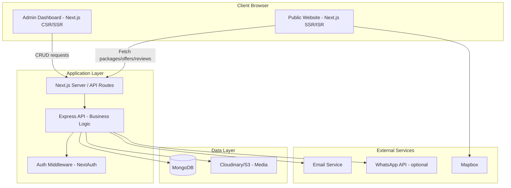
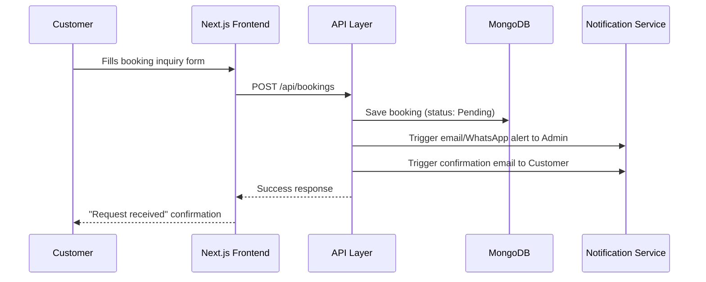

# Tourism Agency Platform — System Architecture

**Client:** Tour Guide → Travel Agency (Startup)
**Type:** Commercial, production-ready web platform
**Booking Model:** Inquiry-based (no payment gateway)

---

## 1. Overview

A modern travel agency platform enabling the client to showcase travel packages and vehicles, run promotional offers, collect and display customer reviews, and receive booking inquiries — fully self-managed through an admin panel.

**Goals:**
- Strong SEO visibility for organic tourist traffic
- Fast, visually premium user experience
- Simple inquiry-based booking (no payment complexity)
- Full content control for a non-technical client

---

## 2. Tech Stack

| Layer | Technology |
|---|---|
| Frontend | Next.js 14+ (App Router), TypeScript |
| Styling/UI | Tailwind CSS, shadcn/ui, Framer Motion |
| Forms/Validation | React Hook Form + Zod |
| Data Fetching (client) | TanStack Query |
| Maps | Mapbox GL JS / Leaflet |
| Backend | Node.js + Express (TypeScript) *or* Next.js API routes |
| Database | MongoDB + Mongoose |
| Media Storage | Cloudinary / AWS S3 |
| Auth (admin only) | NextAuth.js |
| Notifications | Resend/Nodemailer (email), WhatsApp Business API (optional) |
| Hosting | Vercel (frontend) + Render/Railway or VPS (backend + DB) |

---

## 3. High-Level Architecture

---

## 4. Core Modules

### 4.1 Public Site
- Home (hero, featured packages, offers, testimonials)
- Package catalog + detail pages (filterable, SEO-optimized)
- Vehicle fleet showcase
- Promotional offers (time-bound, admin-managed)
- Customer reviews (public display + submission form)
- Blog / travel guides (SEO content)
- Booking inquiry form (no payment)

### 4.2 Booking Inquiry Engine
- Customer submits request (dates, pax, package/vehicle, contact info)
- Status lifecycle: `Pending → Contacted → Confirmed / Cancelled`
- Auto-notifications to client (email/WhatsApp) and customer (confirmation email)
- Admin calendar view to avoid date/vehicle conflicts

### 4.3 Admin Panel
- Package & vehicle CRUD (with image upload)
- Offers/promotions management (with expiry)
- Booking inquiry inbox (status + notes)
- Review moderation (approve/reject before publishing)
- Blog CMS
- Basic analytics (popular packages, inquiry conversion, traffic sources)
- Role support (owner + staff)

---

## 5. Rendering Strategy (SEO-Critical)

| Page Type | Strategy | Reason |
|---|---|---|
| Package listing/detail | **ISR** (revalidate every few min) | Fast + stays fresh as admin updates |
| Blog posts | **SSG** | Rarely changes, max speed |
| Home page | **ISR** | Mix of static + dynamic offers |
| Booking form / Admin dashboard | **SSR / CSR** | User/session-specific, no SEO need |

---

## 6. Data Flow (Booking Inquiry Example)

---

## 7. Security Considerations
- Admin routes protected via NextAuth session + role-based access
- Input validation via Zod on both client and server
- Rate limiting on public booking/review submission endpoints
- Image upload validation (type/size) before Cloudinary upload
- Environment secrets managed via `.env` + hosting provider's secret manager

---

## 8. Deployment

- **Frontend:** Vercel (native Next.js support, edge caching, auto SSR/ISR handling)
- **Backend/API:** Render, Railway, or a VPS (if using separate Express server)
- **Database:** MongoDB Atlas (managed, with automated backups)
- **Media:** Cloudinary (auto image optimization/CDN)
- **Domain/SSL:** Managed via hosting provider or Cloudflare

---

## 9. Next Steps
- Define Mongoose/TypeScript schemas
- Build page-by-page component breakdown
- Design admin dashboard wireframes
